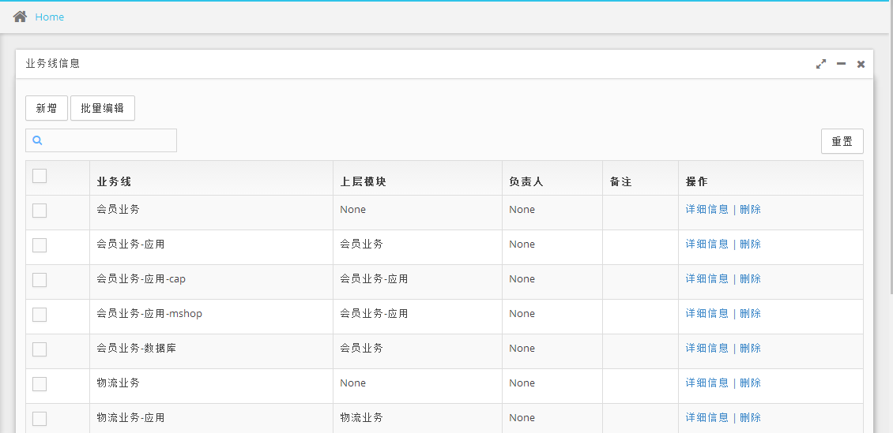

### 开发语言与框架
* 编程语言: Python3.5 +　JavaScript + jQuery
* 后端框架: Django 1.11.3
* 前端框架: Bootstrap

### 实现功能
* 自定义权限框架，使用中间件验证权限
* 支持自定义显示具体字段
* 支持批量编辑数据
* 支持多字段搜索、过滤
* 后端实现分页功能
* 自动实现业务层级关系
* web终端，根据用户权限自动生成服务器列表

### 效果展示
#### 列表页

#### 批量编辑

#### web终端

### 待完成
* web终端历史录像功能
* web终端实时监控功能
* 整合Zabbix、Saltstack
* ......